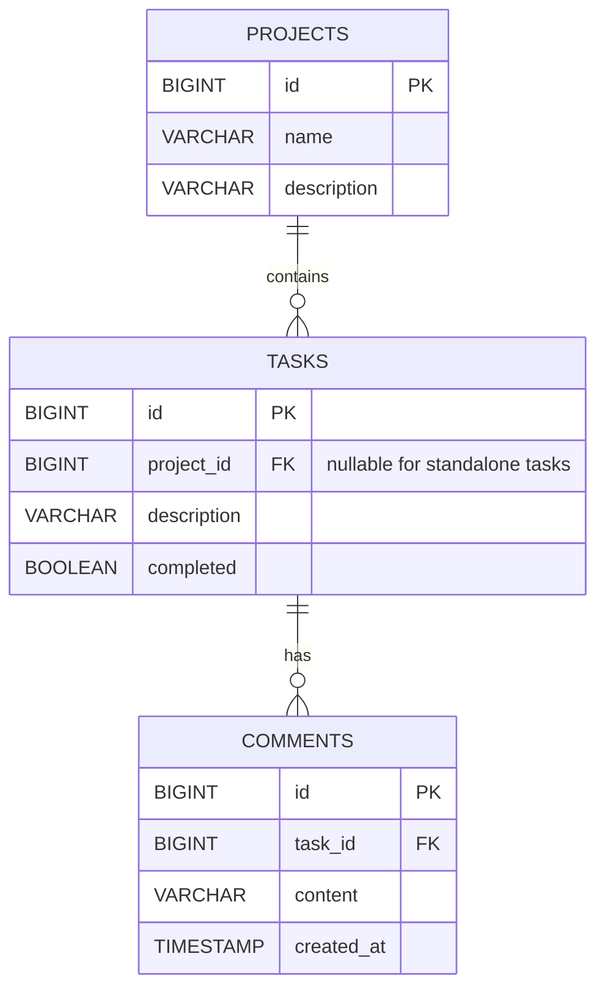

# Project/Task ER 图

```mermaid
erDiagram
    PROJECTS ||--o{ TASKS : contains
    TASKS ||--o{ COMMENTS : has
    PROJECTS {
        BIGINT id PK
        VARCHAR name
        VARCHAR description
    }
    TASKS {
        BIGINT id PK
        BIGINT project_id FK "nullable for standalone tasks"
        VARCHAR description
        BOOLEAN completed
    }
    COMMENTS {
        BIGINT id PK
        BIGINT task_id FK
        VARCHAR content
        TIMESTAMP created_at
    }
```

一个项目可以包含零个或多个任务。`tasks.project_id` 可空，支持不属于项目的独立任务；删除项目时，数据库通过外键级联删除其任务。一个任务可以包含零条或多条评论；删除任务时，评论也会级联删除。
